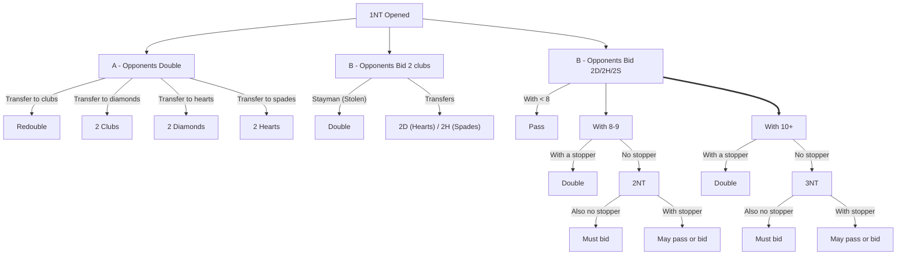

```mermaid

graph TD

    A[1NT Opened] -->OppDbl[A - Opponents Double]
    A[1NT Opened] -->Opp2C[B - Opponents Bid 2 clubs]
    A[1NT Opened] -->Opp2x[B - Opponents Bid 2D/2H/2S]

    OppDbl -->|Transfer to clubs| Redouble
    OppDbl -->|Transfer to diamonds| 2COverDouble[2 Clubs]
    OppDbl -->|Transfer to hearts| 2DOverDouble[2 Diamonds]
    OppDbl -->|Transfer to spades| 2HOverDouble[2 Hearts]
    
    Opp2C -->|"Stayman (Stolen)"| DoubleOver2C[Double]
    Opp2C -->|Transfers| 2DorH["2D (Hearts) / 2H (Spades)"]

    Opp2x -->|"With < 8"| Pass
    Opp2x -->Opp2x8to9[With 8-9]
    Opp2x ==>Opp2x10plus[With 10+]

    Opp2x8to9 -->|With a stopper| Double8to9[Double]
    Opp2x8to9 -->|No stopper| 2NTOpp2x8to9[2NT]
    Opp2x10plus -->|With a stopper| Double10plus[Double]
    Opp2x10plus-->|No stopper| 3NTOpp2x10plus[3NT]

    2NTOpp2x8to9 -->|Also no stopper| MustBid8to9[Must bid]
    2NTOpp2x8to9 -->|With stopper| MayPass8to9[May pass or bid]
    3NTOpp2x10plus -->|Also no stopper| MustBid10plus[Must bid]
    3NTOpp2x10plus -->|With stopper| MayPass10plus[May pass or bid]
```
