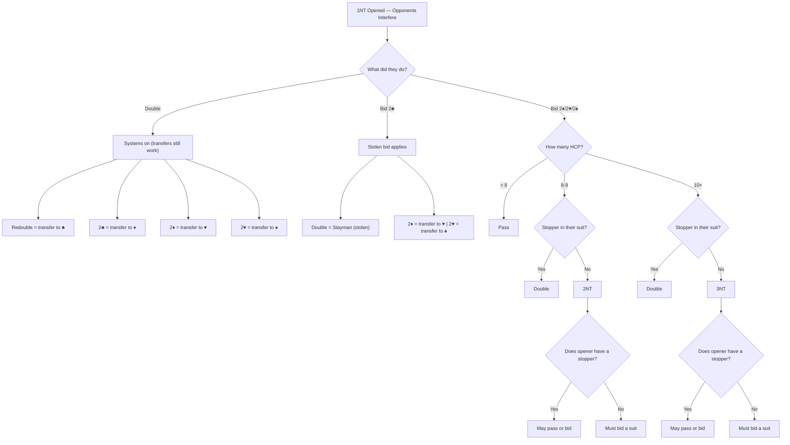

```mermaid

graph TD
    A[1NT Opened — Opponents Interfere] --> WhatDid{What did they do?}

    WhatDid -->|Double| DblSys["Systems on (transfers still work)"]
    WhatDid -->|Bid 2♣| TwoCSys[Stolen bid applies]
    WhatDid -->|Bid 2♦/2♥/2♠| HCP{How many HCP?}

    DblSys --> DblClubs[Redouble = transfer to ♣]
    DblSys --> DblDiamonds[2♣ = transfer to ♦]
    DblSys --> DblHearts[2♦ = transfer to ♥]
    DblSys --> DblSpades[2♥ = transfer to ♠]

    TwoCSys --> StolenStay["Double = Stayman (stolen)"]
    TwoCSys --> StolenXfer["2♦ = transfer to ♥ | 2♥ = transfer to ♠"]

    HCP -->|"< 8"| Pass[Pass]
    HCP -->|8-9| Stopper89{Stopper in their suit?}
    HCP -->|10+| Stopper10{Stopper in their suit?}

    Stopper89 -->|Yes| Dbl89[Double]
    Stopper89 -->|No| TwoNT89[2NT]

    Stopper10 -->|Yes| Dbl10[Double]
    Stopper10 -->|No| ThreeNT10[3NT]

    TwoNT89 --> Opener89{Does opener have a stopper?}
    Opener89 -->|Yes| MayPass89[May pass or bid]
    Opener89 -->|No| MustBid89[Must bid a suit]

    ThreeNT10 --> Opener10{Does opener have a stopper?}
    Opener10 -->|Yes| MayPass10[May pass or bid]
    Opener10 -->|No| MustBid10[Must bid a suit]
```
