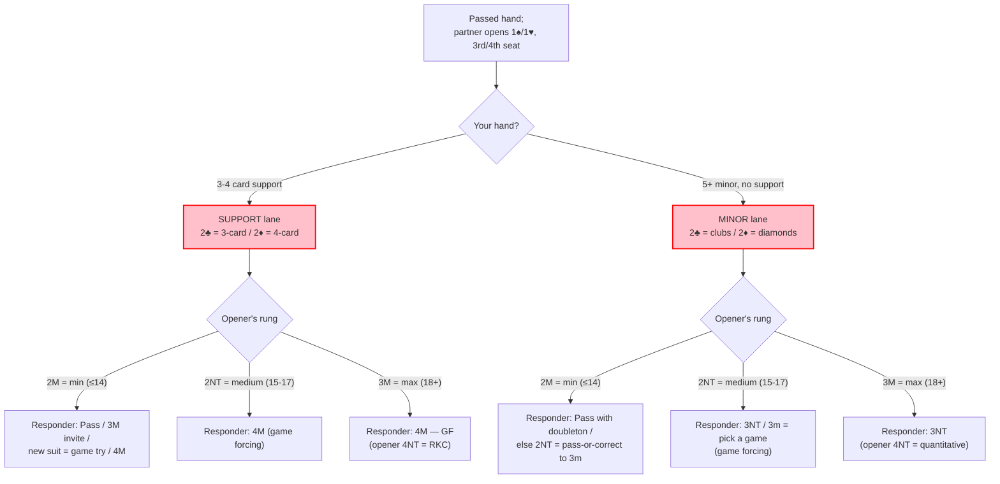

# Dreary

A modified two-way Drury that adds natural 5+ card minor one-suiters for responder. Used by a **passed hand** after partner opens 1♠ or 1♥ in 3rd or 4th seat.

Standard two-way Drury shows a limit raise (2♣ = 3-card support, 2♦ = 4-card support) and guards against a light 3rd/4th-seat opening. Dreary keeps all of that and gives the previously homeless minor one-suiter a defined, constructive path.

---

## Why Dreary — Two Problems It Solves

Dreary fixes two weaknesses of plain Drury for a passed hand:

1. **Drury is lapse-prone, and the lapses are costly.** A misremembered Drury bid makes opener assume a fit that isn't there and drives the auction toward it — you can land in a spade game on a bad misfit with no way back. **A lapse in Dreary, by contrast, still leaves you in a natural bidding sequence** you can navigate with ordinary judgment. You may reach a worse contract; you will not reach an impossible one.

2. **The 11+ hand with a 5-card minor and no support had no home.** A 1NT response underbids it and buries the suit, and the 2♣ / 2♦ slots are spent on Drury. The honest low-tech workaround is to shade the hand down — a 3rd/4th-seat opener can be light, so "lend partner a point" — and respond 1NT. That is a fine **baseline**, and it stays your fallback whenever Dreary is off (over interference). Dreary is the **upgrade**: it gives the hand a defined, descriptive home and lets opener clarify light-vs-sound instead of you guessing.

---

## When It Applies

- Responder is a **passed hand** and partner opens 1♠ or 1♥ in 3rd or 4th seat.
- **Off over any interference**, including a double. If either opponent acts over the opening bid, all bids are natural.

**Notation:** *M* = opener's major; *m* = the minor responder actually bid (clubs after 2♣, diamonds after 2♦). Examples use 1♠; **1♥ is identical with hearts as trumps** — the interior 2♠ step is simply bypassed, and a passed-hand spade one-suiter just bids a natural 1♠ instead of using the convention.

---

## Design Philosophy — Fall Into the Pit of Success

Dreary is intricate, but it is built so you never have to *remember your way to safety*. At every turn, one of three nets protects the partnership:

1. **The artificial calls can't be confused with natural ones.** Every artificial call here is a notrump bid that would be pointless as a natural auction — opener's 2NT facing a possible fit, or responder's 2NT / 3NT pass-or-correct. Each has a single **disclosed** meaning and no sensible natural reading to mistake it for, so applying that disclosed meaning *is* the recovery. These calls also sit at exactly the junctures where bidding on autopilot would misfire, so the clarity is there precisely where you need it. (You always apply the disclosed meaning — never a meaning you suspect partner intended.)

2. **Natural bidding lands you right.** This is the load-bearing net, and the reason the convention holds up at our level. Your first bid *is* your natural bid: with a minor and no support you bid your minor, and Dreary merely makes it legal. Over opener's minimum rung — the common case opposite a light third-seat opener — the choice is pure natural judgment (pass with a doubleton, pull with a singleton), and every final contract is a natural strain. Forget every artificial nuance and just bid bridge, and you will usually arrive in the same place.

3. **When both slip, the error is cheap.** The disaster this convention exists to prevent — 4♠ on a 5-1 fit — is gone. A forgotten sequence lands in a partscore or a thin game, at the two or three level, never a doomed contract. A lapse costs a board, not a number.

---

## Key Principle — Stay in Your Lane

You always know your lane from your own hand:

- **Support lane** — any spade support (3- or 4-card).
- **Minor lane** — no support, but a real 5+ card minor.
- With **both**, support always wins.

Commit to your lane on your first bid and **never switch.** 2♣/2♦ are ambiguous to opener, but never to you. (Wandering from the support lane into a minor-lane bid is the one way to bury a 4-4 major fit — don't.)

---

## Responder's First Bid

| Responder's bid | Shows |
|-----------------|-------|
| 2♣ (alert) | 3-card spade support, 10+ — **or** natural 5+ clubs, 11+ (no support) |
| 2♦ (alert) | 4-card spade support, 10+ — **or** natural 5+ diamonds, 11+ (no support) |

---

## Opener's Rebid — Strength Rungs

| Opener's bid | Range | Meaning |
|--------------|-------|---------|
| 2M | up to ~14 | Light / minimum — signoff rung |
| 2NT (alert) | 15–17 | Medium — **game-forcing** rung |
| 3M | 18+ | Maximum — top rung (game-forcing) |

Opener shows strength *before* knowing responder's lane. The suit rungs (2M, 3M) are natural; **2NT is artificial** and does not show a balanced notrump hand.

Whenever opener shows **15+** (the 2NT or 3M rung) opposite responder's 10+, both lanes are committed to game. Invitational decisions live **only at the 2M minimum rung.**

---

## Decision Map

---

## After the Minimum Rung (2M)

Opener has shown ≤14 and is trying to sign off.

**Support lane — responder's rebids:**

| Responder's bid | Meaning |
|-----------------|---------|
| Pass | Minimum end of range; accept the signoff |
| 3M | Top of range, no useful shortness; mild invitation |
| New suit | Game try |
| 4M | To play — maximum support, wants game opposite the announced minimum |

**Minor lane — responder's rebids:**

| Responder's bid | Meaning |
|-----------------|---------|
| Pass | Doubleton in M — content to play the 5-2 fit |
| 2NT (alert) | 0–1 in M; pass-or-correct (opener passes 2NT or corrects to 3m) |

There is deliberately **no direct 3m** here. The pass-or-correct is self-correcting: opener passes 2NT only when notrump beats the minor (short in m, with stoppers), which is exactly when you'd have disliked 3m anyway.

### After 2m – 2M – 2NT (opener answering the pass-or-correct)

| Opener's bid | Meaning |
|--------------|---------|
| Pass | Notrump is the better spot (**pass if NT is preferable to the minor**) |
| 3m | Correct to the minor |

After opener passes or corrects, responder places the contract normally, assuming no major fit.

---

## After the Medium Rung (2NT)

Opener has shown 15–17. **Both lanes are committed to game.**

**Support lane** — responder's rebids, forcing to game:

| Responder's bid | Meaning |
|-----------------|---------|
| 4M | To play |

**Minor lane** — responder's rebids; game values (26+ combined), game almost always **3NT**:

| Responder's bid | Meaning |
|-----------------|---------|
| 3NT | To play |
| 3m | Forcing; "pick a game." Opener chooses 3NT (default) or, with a fit and a notrump hole, 5m |

- The target is **3NT**, which needs ~25 — you have it. 5m needs ~29 plus a real fit and is only the fallback; you rarely reach it.
- **No pass** — the combined range is game-going.

---

## After the Maximum Rung (3M)

Opener has shown 18+ — **both lanes are game-forcing.** Responder clarifies the lane and places the game:

| Responder's bid | Meaning |
|-----------------|---------|
| 4M | Support lane — to play |
| 3NT | Minor lane — to play |

**4NT is Roman Keycard (1430) only when a fit has been established** (the support lane's 4M). With no fit — after the minor lane's 3NT — **4NT is quantitative.**

---

## Alerts

Rule of thumb: **notrump bids in this system are conventional and alert; the natural suit rungs do not.** Alert rules vary by jurisdiction and platform — when in doubt, alert and be ready to explain the whole convention.

| Bid | Alert? |
|-----|--------|
| Responder's 2♣ / 2♦ (first bid) | Yes |
| Opener's 2M (minimum) | No — natural |
| Opener's 2NT (medium) | Yes |
| Opener's 3M (maximum) | No — natural |
| Responder's 2NT / 3NT pass-or-correct bids | Yes |
