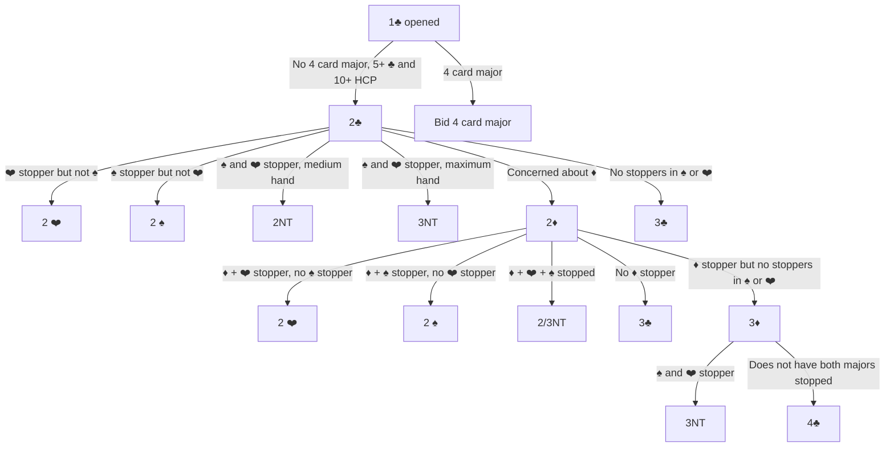
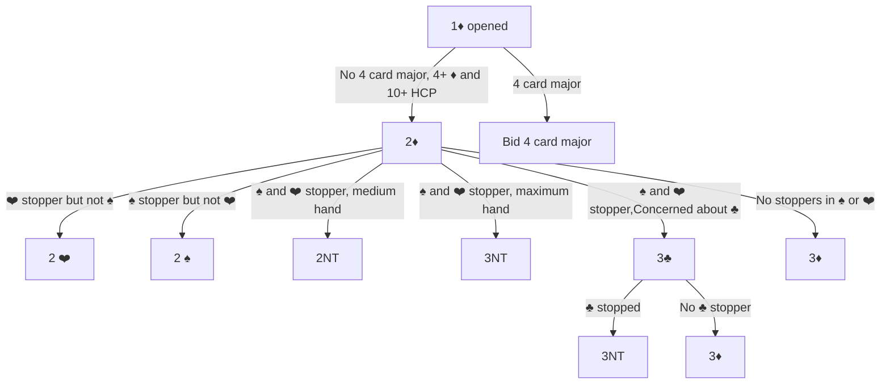
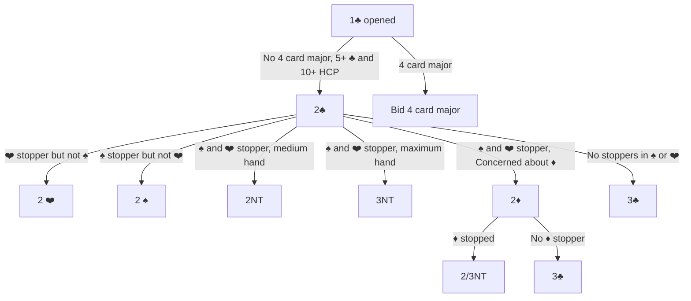

# Inverted Minors
General approach:  
- Opener bids a minor.  
- Responder has no 4 card major but 4+/5+ cards in the opener's minor and 11+ points
- Goal is to explore No Trump by figuring out which suits are stopped, or short-circuit to the minor if No Trump isn't viable
- Once inverted minor is bid, the working assumption is that both minors are stopped unless someone bids the other minor

# Inverted Minor - Clubs #

# Inverted Minor - Diamonds #

# Alternate System A - Bid your stoppers (StopperSystem)

# Alternate System B - Clubs same as Diamonds

# Sample Hands

### Board 1
<iframe width="200px" height="200px" src="https://www.bridgebase.com/tools/handviewer.html?n=SKQ2HJ98DAT842CA7&s=ST6HAK7DKJ76CQJT8" style="border: none"></iframe>

  
[Bidding - Click To Reveal]

    <iframe width="100px" height="100px" src="https://www.bridgebase.com/tools/handviewer.html?a=1dp2dp2sp3n" style="border: none"></iframe>  
    <ol>
        <li>North opens 1♦️</li>
        <li>South bids 2♦️</li>
        <li>North has a stopper in ♠️, but not ❤️, so bids 2♠️</li>
        <li>South has ❤️ and 14hcp, so bids 3NT</li>
    </ol> 

##### StopperSystem

  
[Bidding - Click To Reveal]

    <iframe width="100px" height="100px" src="https://www.bridgebase.com/tools/handviewer.html?a=1dp2dp2sp3n" style="border: none"></iframe>  
    <ol>
        <li>North opens 1♦️</li>
        <li>South bids 2♦️</li>
        <li>North has a stopper in ♠️, but not ❤️, so bids 2♠️</li>
        <li>South has ❤️ and ♣️ and 14hcp, so bids 3NT</li>
    </ol> 

### Board 2
<iframe width="200px" height="200px" src="https://www.bridgebase.com/tools/handviewer.html?n=SQJHA2DA8632CK632&s=SK2HQJDKJT95CA984" style="border: none"></iframe>

  
[Bidding - Click To Reveal]

    <iframe width="100px" height="100px" src="https://www.bridgebase.com/tools/handviewer.html?a=1dp2dp2hp3n" style="border: none"></iframe>  
    <ol>
        <li>North opens 1♦️</li>
        <li>South bids 2♦️</li>
        <li>North has a stopper in ❤️, but is not sure about ♠️, so bids 2❤️</li>
        <li>South has a stopper in ♠️ with the K, and 14hcp, so bids 3NT</li>
    </ol> 

##### StopperSystem

  
[Bidding - Click To Reveal]

    <iframe width="100px" height="100px" src="https://www.bridgebase.com/tools/handviewer.html?a=1dp2dp2hp3n" style="border: none"></iframe>  
    <ol>
        <li>North opens 1♦️</li>
        <li>South bids 2♦️</li>
        <li>North has a stopper in ❤️ so bids 2❤️</li>
        <li>South has a stopper in ♠️ with the K and in ♣️ and 14hcp so bids 3NT</li>
    </ol> 

### Board 3
<iframe width="200px" height="200px" src="https://www.bridgebase.com/tools/handviewer.html?n=SKQT7HAJ43DQ975C6&s=SA64HDAK43CAJ9743" style="border: none"></iframe>

  
[Bidding - Click To Reveal]

    <iframe width="100px" height="100px" src="https://www.bridgebase.com/tools/handviewer.html?a=1dp2dp3cp3n" style="border: none"></iframe>  
    <ol>
        <li>North opens 1♦️</li>
        <li>South bids 2♦️</li>
        <li>North has a stopper in ❤️ and ♠️, but is concerned about the singleton low ♣️, so bids 3♣️</li>
        <li>South has a stopper in ♣️ so bids 3NT</li>
    </ol> 

##### StopperSystem

  
[Bidding - Click To Reveal]

    <iframe width="100px" height="100px" src="https://www.bridgebase.com/tools/handviewer.html?a=1dp2dp2hp2sp3cp3n" style="border: none"></iframe>  
    <ol>
        <li>North opens 1♦️</li>
        <li>South bids 2♦️</li>
        <li>North has a stopper in ❤️ so bids 2❤️</li>
        <li>South has a stopped in ♠️ so bids 2♠️</li>
        <li>North does not have a stopper in ♣️, so bids 3♣️</li>
        <li>South has a stopper in ♣️ so bids 3NT</li>
    </ol> 

### Board 4
<iframe width="200px" height="200px" src="https://www.bridgebase.com/tools/handviewer.html?n=ST42HA53DA5CAQ965&s=SA75HK2DQT2CKT742" style="border: none"></iframe>

  
[Bidding - Click To Reveal]

    <iframe width="100px" height="100px" src="https://www.bridgebase.com/tools/handviewer.html?a=1cp2cp2hp2np3n" style="border: none"></iframe>  
    <ol>
        <li>North opens 1♣️</li>
        <li>South bids 2♣️</li>
        <li>North has a stopper in ❤️, but is not sure about ♠️, so bids 2❤️</li>
        <li>South has a stopper in ♠️ with the A, and 12hcp, so bids 2NT</li>
        <li>North has 14hcp, so bids 3NT</li>
    </ol> 

##### StopperSystem

  
[Bidding - Click To Reveal]

    <iframe width="100px" height="100px" src="https://www.bridgebase.com/tools/handviewer.html?a=1dp2dp2hp2sp2np3n" style="border: none"></iframe>  
    <ol>
        <li>North opens 1♣️</li>
        <li>South bids 2♣️</li>
        <li>North has a stopper in ♦️, so bids 2♦️</li>
        <li>South has a stopper in ❤️ with the K, so bids 2❤️</li>
        <li>North has a stopper in ♠️ so bids 2♠️</li>
        <li>South has a stopper in ♣️ and 12hcp, so bids 2NT</li>
        <li>North has 14hcp, so bids 3NT</li>
    </ol> 

### Board 5
<iframe width="200px" height="200px" src="https://www.bridgebase.com/tools/handviewer.html?n=SQJ8HAJD8632CAQ75&s=S54HQ2DAKJ54CKJ94" style="border: none"></iframe>

  
[Bidding - Click To Reveal]

    <iframe width="100px" height="100px" src="https://www.bridgebase.com/tools/handviewer.html?a=1dp2dp2np3n" style="border: none"></iframe>  
    <ol>
        <li>North opens 1♦️</li>
        <li>South bids 2♦️</li>
        <li>North has a stopper in ❤️ and ♠️, and a minimum hand, so bids 2NT</li>
        <li>South has a maximum so bids 3NT</li>
    </ol> 

##### StopperSystem

  
[Bidding - Click To Reveal]

    <iframe width="100px" height="100px" src="https://www.bridgebase.com/tools/handviewer.html?a=1dp2dp2hp3cp3n" style="border: none"></iframe>  
    <ol>
        <li>North opens 1♦️</li>
        <li>South bids 2♦️</li>
        <li>North has a stopper in ❤️, so bids ❤️</li>
        <li>South has a stopper in ♣️ but not ♠️ so bids 3♣️</li>
        <li>North has a stopper with the QJx so bids 3NT</li>
    </ol> 

### Board 6
<iframe width="200px" height="200px" src="https://www.bridgebase.com/tools/handviewer.html?n=ST42HA53DA5CAQ965&s=SA75HK2DQT2CKT742" style="border: none"></iframe>

  
[Bidding - Click To Reveal]

    <iframe width="100px" height="100px" src="https://www.bridgebase.com/tools/handviewer.html?a=1cp2cp2hp2np3n" style="border: none"></iframe>  
    <ol>
        <li>North opens 1♣️</li>
        <li>South bids 2♣️</li>
        <li>North has a stopper in ❤️, but not ♠️, so bids 2❤️</li>
        <li>South has a stopper in ♠️ and 12hcp, so bids 2NT</li>
        <li>North has 14hcp, and takes it to 3NT</li>
    </ol> 

##### StopperSystem

  
[Bidding - Click To Reveal]

    <iframe width="100px" height="100px" src="https://www.bridgebase.com/tools/handviewer.html?a=1cp2cp2dp2hp3cp3n" style="border: none"></iframe>  
    <ol>
        <li>North opens 1♣️</li>
        <li>South bids 2♣️</li>
        <li>North has a stopper in ♦️, so bids 2♦️</li>
        <li>South has a stopper in ❤️, so bids 2❤️</li>
        <li>North lacks a stopper in ♠️ but has one in ♣️ so bids 3♣️</li>
        <li>South has a stopper in ♠️ so bids 3NT</li>
    </ol> 

### Board 7
<iframe width="200px" height="200px" src="https://www.bridgebase.com/tools/handviewer.html?n=SK72HQJ7DAQ76C632&s=S8HK54DJT532CAK74" style="border: none"></iframe>

  
[Bidding - Click To Reveal]

    <iframe width="100px" height="100px" src="https://www.bridgebase.com/tools/handviewer.html?a=1dp2dp2npp" style="border: none"></iframe>  
    <ol>
        <li>North opens 1♦️</li>
        <li>South bids 2♦️</li>
        <li>North has a stopper in ❤️ and ♠️, and a minimum hand, so bids 2NT</li>
        <li>With only a minimum hand, south passes</li>
    </ol> 

##### StopperSystem - DIFFERENT CONTRACT

  
[Bidding - Click To Reveal]

    <iframe width="100px" height="100px" src="https://www.bridgebase.com/tools/handviewer.html?a=1dp2dp2hp3cp3n" style="border: none"></iframe>  
    <ol>
        <li>North opens 1♦️</li>
        <li>South bids 2♦️</li>
        <li>North has a stopper in ❤️, so bids 2❤️</li>
        <li>South lacks a stopper in ♠️ but has one in ♣️ so bids 3♣️</li>
        <li>North has ♠️ stopped so bids 3NT</li>
    </ol> 

### Board 8
<iframe width="200px" height="200px" src="https://www.bridgebase.com/tools/handviewer.html?n=S4HKDAQ8742CKQJT3&s=SA9HA5DKT93C97654" style="border: none"></iframe>

  
[Bidding - Click To Reveal]

    <iframe width="100px" height="100px" src="https://www.bridgebase.com/tools/handviewer.html?a=1dp2dp5dpp" style="border: none"></iframe>  
    <ol>
        <li>North has too many hcp to open 1NT and not enough for 2NT.  North opens 1♦️</li>
        <li>South bids 2♦️</li>
        <li>North isn't too interested in NT because of the distributional power of the hand.  North knows they have at least 10♦️ and can find at least 17 total points if you include the length in ♦️.  If North bids 4NT they might get too high and have to play in 6♦️, so North bids 5♦️</li>
        <li>With 11 hcp, the bare minimum, south passes.</li>
    </ol> 

##### StopperSystem

  
[Bidding - Click To Reveal]

    <iframe width="100px" height="100px" src="https://www.bridgebase.com/tools/handviewer.html?a=1dp2dp3cp3np5dpp" style="border: none"></iframe>  
    <ol>
        <li>North has too many hcp to open 1NT and not enough for 2NT.  North opens 1♦️</li>
        <li>South bids 2♦️</li>
        <li>North isn't too interested in NT because of the distributional power of the hand.  North knows they have at least 10♦️ and can find at least 17 total points if you include the length in ♦️.  If North bids 4NT they might get too high and have to play in 6♦️.  North can find out more about south's hand without getting too high by showing a ♣️ stopper.  If South shows stoppers in ❤️ or ♠️ north can consider going to 4NT to ask for keycards.  North will have another chance to bid, so bids 3♣️</li>
        <li>South has both remaining suits stopped, and does not want to bid 3❤️ because north would bid ♦️ if they don't have ♠️ covered.  South bids 3NT</li>
        <li>North knows south has stoppers in the two majors.  There's a chance that slam is there, but 4NT would be a quantitative invite.  North bids 5♦️</li>
        <li>South might figure out north's slam interest, but with 11hcp, probably they pass</li>
    </ol> 

### Board 9
<iframe width="200px" height="200px" src="https://www.bridgebase.com/tools/handviewer.html?n=SK97HK954DKJ62CQ5&s=SAJ6HA7DT954CAJT6" style="border: none"></iframe>

  
[Bidding - Click To Reveal]

    <iframe width="100px" height="100px" src="https://www.bridgebase.com/tools/handviewer.html?a=1dp2dp2np3n" style="border: none"></iframe>  
    <ol>
        <li>North opens 1♦️</li>
        <li>South bids 2♦️</li>
        <li>North has a stopper in ❤️ and ♠️, and a minimum hand, so bids 2NT</li>
        <li>With 14hcp, north takes it to 3NT</li>
    </ol> 

##### StopperSystem

##### StopperSystem - DIFFERENT CONTRACT (Direction)

  
[Bidding - Click To Reveal]

    <iframe width="100px" height="100px" src="https://www.bridgebase.com/tools/handviewer.html?a=1dp2dp2hp2sp3dp3n" style="border: none"></iframe>  
    <ol>
        <li>North opens 1♦️</li>
        <li>South bids 2♦️</li>
        <li>North has a stopper in ❤️ so bids 2❤️</li>
        <li>South has a stopper in ♠️ so bids 2♠️</li>
        <li>North has no stopper in ♣️ so bids 3♦️</li>
        <li>South has a stopper in ♣️ so bids 3NT</li>
    </ol> 

### Board 10
<iframe width="200px" height="200px" src="https://www.bridgebase.com/tools/handviewer.html?n=SKT63HAQ62D764CK5&s=SQ2HK93DAT32CQ842" style="border: none"></iframe>

  
[Bidding - Click To Reveal]

    <iframe width="100px" height="100px" src="https://www.bridgebase.com/tools/handviewer.html?a=1dp2dp2npp" style="border: none"></iframe>  
    <ol>
        <li>North opens 1♦️</li>
        <li>South bids 2♦️</li>
        <li>North has a stopper in ❤️ and ♠️, and a minimum hand, so bids 2NT</li>
        <li>With only a minimum hand, south passes</li>
    </ol> 

##### StopperSystem - DIFFERENT CONTRACT

  
[Bidding - Click To Reveal]

    <iframe width="100px" height="100px" src="https://www.bridgebase.com/tools/handviewer.html?a=1dp2dp2hp3cp3n" style="border: none"></iframe>  
    <ol>
        <li>North opens 1♦️</li>
        <li>South bids 2♦️</li>
        <li>North has a stopper in ❤️  so bids 2❤️</li>
        <li>South has no ♠️ but has a stopper in ♣️ so bids 3♣️</li>
        <li>North has a stopper in ♠️ so bids 3NT</li>
    </ol> 

### Board 11
<iframe width="200px" height="200px" src="https://www.bridgebase.com/tools/handviewer.html?n=SKQJHQJDAKJ3CQ864&s=SA96HA85D87654CA5" style="border: none"></iframe>

  
[Bidding - Click To Reveal]

    <iframe width="100px" height="100px" src="https://www.bridgebase.com/tools/handviewer.html?a=1dp2dp2hp3np4npp" style="border: none"></iframe>  
    <ol>
        <li>North opens 1♦️</li>
        <li>South bids 2♦️</li>
        <li>North has a ton of points.  We are certainly at least in game.  North can still force bidding to continue and learn more about south's hand.  With no stopper in ❤️, north bids ♠️.</li>
        <li>South has ❤️ and 12hcp, so bids 3NT</li>
        <li>North knows they have slam potential in NT now.  North bids a quantitative invite of 4NT.</li>
        <li>With only 12hcp, south is pretty close to the minimum for their bids so far, so south passes.</li>
    </ol> 

##### StopperSystem

  
[Bidding - Click To Reveal]

    <iframe width="100px" height="100px" src="https://www.bridgebase.com/tools/handviewer.html?a=1dp2dp2hp3np4npp" style="border: none"></iframe>  
    <ol>
        <li>North opens 1♦️</li>
        <li>South bids 2♦️</li>
        <li>North has a ton of points.  We are certainly at least in game.  North can still force bidding to continue and learn more about south's hand.  With no stopper in ❤️, north bids ♠️.</li>
        <li>South has ❤️ and ♣️ stopped, and 12hcp, so bids 3NT</li>
        <li>North knows they have slam potential in NT now.  North bids a quantitative invite of 4NT.</li>
        <li>With only 12hcp, south is pretty close to the minimum for their bids so far, so south passes.</li>
    </ol> 

## TODO:  Annotate below this line

### Board e
<iframe width="200px" height="200px" src="https://www.bridgebase.com/tools/handviewer.html?n=SA642HAQ54DQ98C87&s=SQTHKDAKT653CQJ96" style="border: none"></iframe>

  
[Bidding - Click To Reveal]

    <iframe width="100px" height="100px" src="https://www.bridgebase.com/tools/handviewer.html?a=1dp2dp3cp3n" style="border: none"></iframe>  
    <ol>
        <li>North opens 1♦️</li>
        <li>South bids 2♦️</li>
        <li>North has a stopper in ❤️ and ♠️, but is concerned about the singleton low ♣️, so bids 3♣️</li>
        <li>South has a stopper in ♣️ so bids 3NT</li>
    </ol> 

### Board f
<iframe width="200px" height="200px" src="https://www.bridgebase.com/tools/handviewer.html?n=SA6HKJ63DK52CJT52&s=S983H2DAQT9CAK863" style="border: none"></iframe>

  
[Bidding - Click To Reveal]

    <iframe width="100px" height="100px" src="https://www.bridgebase.com/tools/handviewer.html?a=1dp2dp2np3n" style="border: none"></iframe>  
    <ol>
        <li>North opens 1♦️</li>
        <li>South bids 2♦️</li>
        <li>North has a stopper in ❤️ and ♠️, and a minimum hand, so bids 2NT</li>
        <li>With 14hcp, north takes it to 3NT</li>
    </ol> 

### Board g
<iframe width="200px" height="200px" src="https://www.bridgebase.com/tools/handviewer.html?n=SAT64HKQ42DK873C5&s=S98HAT9DQT54CAK83" style="border: none"></iframe>

  
[Bidding - Click To Reveal]

    <iframe width="100px" height="100px" src="https://www.bridgebase.com/tools/handviewer.html?a=1dp2dp3cp3n" style="border: none"></iframe>  
    <ol>
        <li>North opens 1♦️</li>
        <li>South bids 2♦️</li>
        <li>North has a stopper in ❤️ and ♠️, but is concerned about the singleton low ♣️, so bids 3♣️</li>
        <li>South has a stopper in ♣️ so bids 3NT</li>
    </ol> 

### Board h
<iframe width="200px" height="200px" src="https://www.bridgebase.com/tools/handviewer.html?n=SQ872HJTDAJ64CA96&s=SA5HA95DQT872CQ74" style="border: none"></iframe>

  
[Bidding - Click To Reveal]

    <iframe width="100px" height="100px" src="https://www.bridgebase.com/tools/handviewer.html?a=1cp2cp2hp2npp" style="border: none"></iframe>  
    <ol>
        <li>North opens 1♣️</li>
        <li>South bids 2♣️</li>
        <li>North has a stopper in ❤️, but not ♠️, so bids 2❤️</li>
        <li>South has a stopper in ♠️ and 12hcp, so bids 2NT</li>
        <li>With 12hcp south passes</li>
    </ol> 

### Board i
<iframe width="200px" height="200px" src="https://www.bridgebase.com/tools/handviewer.html?n=SA65HKQ86DT765CA7&s=SKJ7H4DAJ9843CK94" style="border: none"></iframe>

### Board j
<iframe width="200px" height="200px" src="https://www.bridgebase.com/tools/handviewer.html?n=SK7HAK54DQ985C952&s=SAT4HT9DKJ632CKT4" style="border: none"></iframe>

### Board k
<iframe width="200px" height="200px" src="https://www.bridgebase.com/tools/handviewer.html?n=SAKJ8HAT93D75CT87&s=S7HJ82DKJ92CKQJ42" style="border: none"></iframe>

### Board l
<iframe width="200px" height="200px" src="https://www.bridgebase.com/tools/handviewer.html?n=SAK72HQT8DQT42CK6&s=SJ93HA53DAKJ8CT94" style="border: none"></iframe>

### Board m
<iframe width="200px" height="200px" src="https://www.bridgebase.com/tools/handviewer.html?n=SAKQ2HQ976DAT8CKJ&s=S764HKJ5DQ652CAQ4" style="border: none"></iframe>

### Board n
<iframe width="200px" height="200px" src="https://www.bridgebase.com/tools/handviewer.html?n=SAKJ7HQ765D984CK8&s=ST4HA8DKQJTCJ7653" style="border: none"></iframe>

### Board o
<iframe width="200px" height="200px" src="https://www.bridgebase.com/tools/handviewer.html?n=SKJ65HQ92DK982CK8&s=SAQ2HA8DT7653CA96" style="border: none"></iframe>

### Board p
<iframe width="200px" height="200px" src="https://www.bridgebase.com/tools/handviewer.html?n=SAJ98HA62DK632CAQ&s=SQHK94DAQ97C97432" style="border: none"></iframe>

### Board q
<iframe width="200px" height="200px" src="https://www.bridgebase.com/tools/handviewer.html?n=SAJT5HAJ9DAKJ8C98&s=S4HKQD97542CAKQJ4" style="border: none"></iframe>

### Board r
<iframe width="200px" height="200px" src="https://www.bridgebase.com/tools/handviewer.html?n=SJ987HK52DKQ2CA54&s=SQHAJ9DAJ65CKT983" style="border: none"></iframe>

### Board s
<iframe width="200px" height="200px" src="https://www.bridgebase.com/tools/handviewer.html?n=SAJ62HK97DAJ92CJ7&s=SK53HQJDKT843CA43" style="border: none"></iframe>

### Board t
<iframe width="200px" height="200px" src="https://www.bridgebase.com/tools/handviewer.html?n=SAK94HK82DAT76CT4&s=S832HAJDJ542CAJ97" style="border: none"></iframe>

