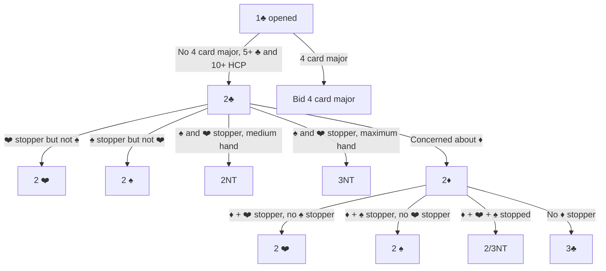
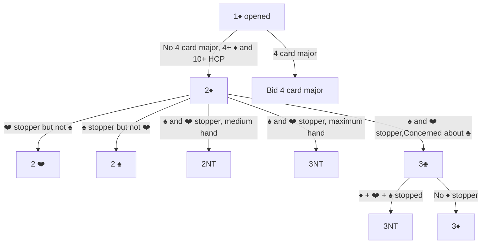

# Inverted Minors
General approach:  
- Opener bids a minor.  
- Responder has no 4 card major but 4+/5+ cards in the opener's minor and 11+ points
- Goal is to explore No Trump by figuring out which suits are stopped, or short-circuit to the minor if No Trump isn't viable
- Once inverted minor is bid, the working assumption is that both minors are stopped unless someone bids the other minor

# Inverted Minor - Clubs #

# Inverted Minor - Diamonds #

# Sample Hands
## TODO:  ANNOTATE

<iframe width="200px" height="200px" src="https://www.bridgebase.com/tools/handviewer.html?n=SQJ64HAT2DKQ32C82&s=SK8HKDAT8764CAK96" style="border: none"></iframe>
<iframe width="200px" height="200px" src="https://www.bridgebase.com/tools/handviewer.html?n=SKQ2HJ98DAT842CA7&s=ST6HAK7DKJ76CQJT8" style="border: none"></iframe>
<iframe width="200px" height="200px" src="https://www.bridgebase.com/tools/handviewer.html?n=S864HA85DKQJCAJ74&s=SAQHDT976542CKQ82" style="border: none"></iframe>
<iframe width="200px" height="200px" src="https://www.bridgebase.com/tools/handviewer.html?n=SK762HKJT9D32CAJ9&s=SA8HA87DA5CKT6543" style="border: none"></iframe>
<iframe width="200px" height="200px" src="https://www.bridgebase.com/tools/handviewer.html?n=SAT8HAQTD652CAQJ3&s=SKJHJ65DA98CK7542" style="border: none"></iframe>
<iframe width="200px" height="200px" src="https://www.bridgebase.com/tools/handviewer.html?n=SAQ52H543DKQJ9C54&s=S8HA86DAT32CAT973" style="border: none"></iframe>
<iframe width="200px" height="200px" src="https://www.bridgebase.com/tools/handviewer.html?n=S64HQ3DAJ84CKQ863&s=SAK9H82DKQT652CJ7" style="border: none"></iframe>
<iframe width="200px" height="200px" src="https://www.bridgebase.com/tools/handviewer.html?n=SQJHA2DA8632CK632&s=SK2HQJDKJT95CA984" style="border: none"></iframe>
<iframe width="200px" height="200px" src="https://www.bridgebase.com/tools/handviewer.html?n=SKQT7HAJ43DQ975C6&s=SA64HDAK43CAJ9743" style="border: none"></iframe>
<iframe width="200px" height="200px" src="https://www.bridgebase.com/tools/handviewer.html?n=SKQT8HAQT2DJ6C942&s=S5HK98DAKT32CQT53" style="border: none"></iframe>
<iframe width="200px" height="200px" src="https://www.bridgebase.com/tools/handviewer.html?n=ST42HA53DA5CAQ965&s=SA75HK2DQT2CKT742" style="border: none"></iframe>
<iframe width="200px" height="200px" src="https://www.bridgebase.com/tools/handviewer.html?n=SA96HA74DKQ5CQ642&s=SKT7HK82DJT632CAK" style="border: none"></iframe>
<iframe width="200px" height="200px" src="https://www.bridgebase.com/tools/handviewer.html?n=SAJ98HAQ5DAJ96CAQ&s=SK3HKJTDK743CK764" style="border: none"></iframe>
<iframe width="200px" height="200px" src="https://www.bridgebase.com/tools/handviewer.html?n=SQJ8HAJD8632CAQ75&s=S54HQ2DAKJ54CKJ94" style="border: none"></iframe>
<iframe width="200px" height="200px" src="https://www.bridgebase.com/tools/handviewer.html?n=SQ853HAK82D7CK752&s=SA7HQTDAKJT5432CQ" style="border: none"></iframe>
<iframe width="200px" height="200px" src="https://www.bridgebase.com/tools/handviewer.html?n=SK72HQJ7DAQ76C632&s=S8HK54DJT532CAK74" style="border: none"></iframe>
<iframe width="200px" height="200px" src="https://www.bridgebase.com/tools/handviewer.html?n=SKQ4HT97DAT8CAJ72&s=SA7HKJ2DK7542CKQ5" style="border: none"></iframe>
<iframe width="200px" height="200px" src="https://www.bridgebase.com/tools/handviewer.html?n=SKQ32HQ93DK6CKQT8&s=SA5HAJDJT74CA7543" style="border: none"></iframe>
<iframe width="200px" height="200px" src="https://www.bridgebase.com/tools/handviewer.html?n=SAQT8HQJ9DA972CA5&s=SJ9HA4DKQJ54CQ876" style="border: none"></iframe>
<iframe width="200px" height="200px" src="https://www.bridgebase.com/tools/handviewer.html?n=SQ842HAT7DJCKQ975&s=SAK7HKQD87653C642" style="border: none"></iframe>
