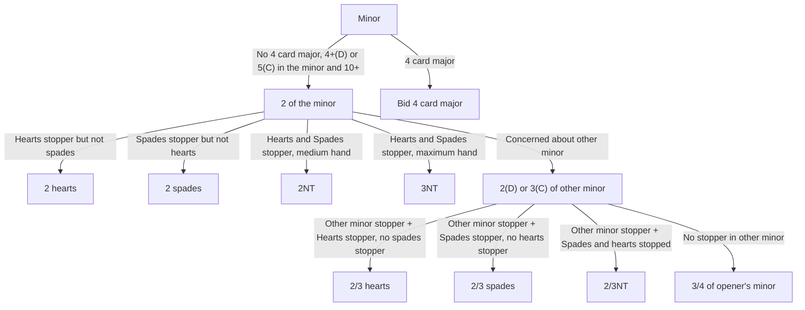

# Inverted Minors
General approach:  
- Opener bids a minor.  
- Responder has no 4 card major but 4+ cards in the opener's minor and 11+ points
- Goal is to explore No Trump by figuring out which suits are stopped, or short-circuit to the minor if No Trump isn't viable
- Once inverted minor is bid, the working assumption is that both minors are stopped unless someone bids the other minor

# Sample Hands (TO DO)
♦️❤️♠️♣️
