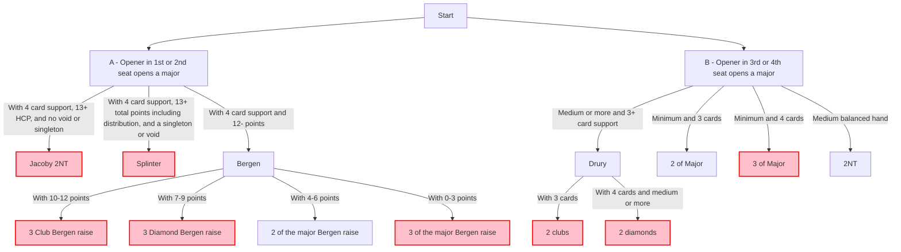

# Major Raises

## General Approach
- Use Bergen to show invitational 4 card support
- Use Splinter to show game-forcing 4 card support with a singleton or void.  Usually the singleton or void is not an honor.
- Use Jacoby 2NT to show game-forcing **or better** 4 card support
- Use Drury with a passed hand to show 3+ card support and at least a minimum hand

## When to choose splinter or Jacoby 2NT
- A splinter usually is limited in point range to less-than-slam.  It puts your partner in control of deciding how high.
- Because your honors are usually not in the splinter suit, partner could potentially explore slam if there's a good fit in other suits and they don't have many HCP in the splinter suit.
- Jacoby 2NT can be slam-worthy.  It puts you in control of deciding how high.

  Alertable

