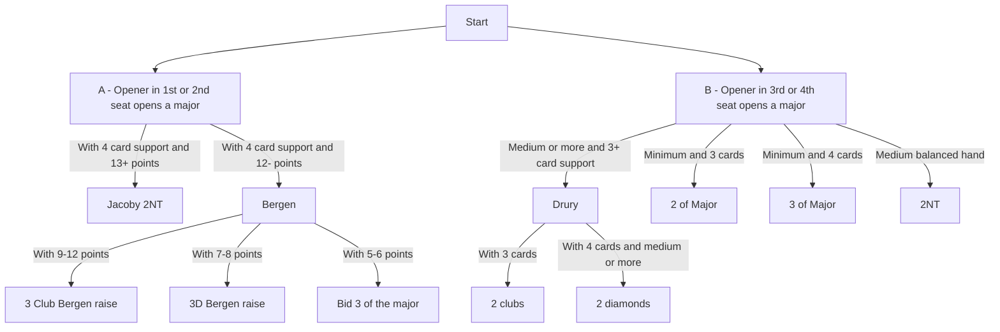

```mermaid

graph TD
    A[Start] -->B1[A - Opener in 1st or 2nd seat opens a major]
    A[Start] -->3rdseat[B - Opener in 3rd or 4th seat opens a major]

    B1 -->|With 4 card support and 13+ points| Jacoby[Jacoby 2NT]
    B1 -->|With 4 card support and 12- points| Bergen[Bergen]

    Bergen -->|With 9-12 points| D1[3 Club Bergen raise]
    Bergen -->|With 7-8 points| D2[3D Bergen raise]
    Bergen -->|With 5-6 points| D3[Bid 3 of the major]

    3rdseat -->|Medium or more and 3+ card support| Drury[Drury]
    Drury -->|With 3 cards| E1[2 clubs]
    Drury -->|With 4 cards and medium or more| E2[2 diamonds]
    3rdseat -->|Minimum and 3 cards| E3[2 of Major]
    3rdseat -->|Minimum and 4 cards| E4[3 of Major]
    3rdseat -->|Medium balanced hand| E5[2NT]
```