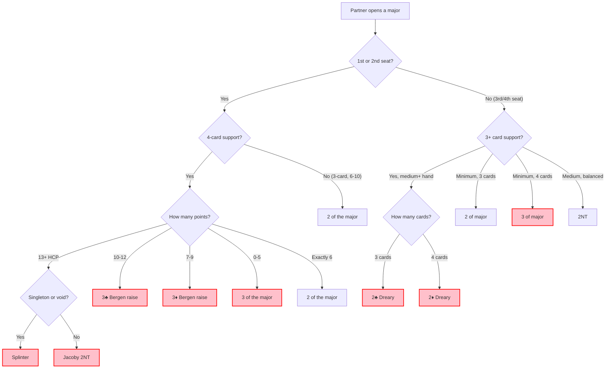

# Major Raises

## General Approach
- A simple raise to 2M covers two hands: 3-card support with 6–10 points, or exactly 6 points with 4-card support
- Use Bergen (3♣ or 3♦) to show 4-card support in the 7–12 point range
- Use a preemptive 3M to show 4-card support with 0–5 points (alertable)
- Use Splinter to show game-forcing 4 card support with a singleton or void.  Usually the singleton or void is not an honor.
- Use Jacoby 2NT to show game-forcing **or better** 4 card support
- Use [**Dreary**](Dreary.md) (our two-way Drury variant) with a passed hand — 3+ card support, **or** a natural 5+ card minor with no support (see [Dreary](Dreary.md) for the full convention)
- After a splinter bid, if opener has wasted honors in the short suit, opener usually will sign off in game

## When to choose splinter or Jacoby 2NT
- A splinter usually is limited in point range to less-than-slam.  It puts your partner in control of deciding how high.
- Because your honors are usually not in the splinter suit, partner could potentially explore slam if there's a good fit in other suits and they don't have many HCP in the splinter suit.
- Jacoby 2NT can be slam-worthy.  It puts you in control of deciding how high.

```mermaid

graph TD
    Start[Partner opens a major] --> Seat{1st or 2nd seat?}

    Seat -->|Yes| Support{4-card support?}
    Seat -->|"No (3rd/4th seat)"| Dreary{3+ card support?}

    Support -->|Yes| Strength{How many points?}
    Support -->|"No (3-card, 6-10)"| TwoM[2 of the major]

    Strength -->|"13+ HCP"| Short{Singleton or void?}
    Strength -->|10-12| Bergen3C[3♣ Bergen raise]:::alerted
    Strength -->|7-9| Bergen3D[3♦ Bergen raise]:::alerted
    Strength -->|0-5| ThreeM[3 of the major]:::alerted
    Strength -->|Exactly 6| TwoM2[2 of the major]

    Short -->|Yes| Splinter[Splinter]:::alerted
    Short -->|No| Jacoby[Jacoby 2NT]:::alerted

    Dreary -->|"Yes, medium+ hand"| DrearyBid{How many cards?}
    Dreary -->|"Minimum, 3 cards"| E3[2 of major]
    Dreary -->|"Minimum, 4 cards"| E4[3 of major]:::alerted
    Dreary -->|"Medium, balanced"| E5[2NT]

    DrearyBid -->|3 cards| E1[2♣ Dreary]:::alerted
    DrearyBid -->|4 cards| E2[2♦ Dreary]:::alerted

    classDef alerted fill:#FFC0CB,stroke:#ff0000,stroke-width:2px;
```

  Alertable

